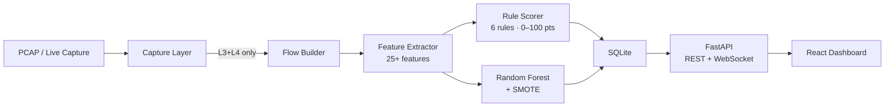
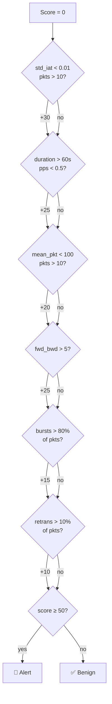
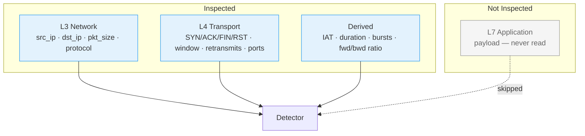
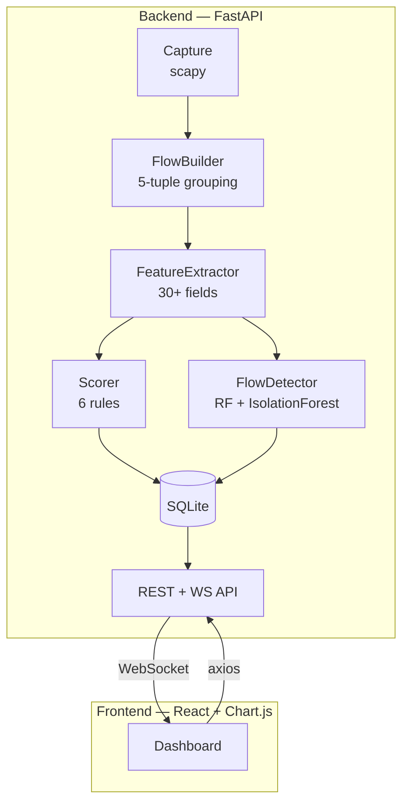
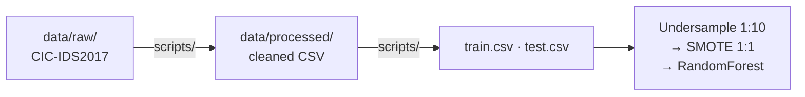

# TCP Covert Channel Detector

[](LICENSE)
[](backend/requirements.txt)
[](frontend/package.json)
[](docker-compose.yml)
[](.github/workflows/ci.yml)

Real-time covert channel & data exfiltration detection using **only TCP/IP metadata** — no payload inspection. Privacy-preserving by design.

---

## Pipeline



## Detection Logic



## OSI Layer Coverage



| Layer | What It Catches |
|-------|----------------|
| **L3 — Network** | Who's talking, data volume |
| **L4 — Transport** | Handshake anomalies, flow control abuse |
| **Derived** | Timing patterns, periodicity, asymmetry |
| **L7 — Application** | *Not inspected* |

## Architecture



## Dataset & Training



- **Source**: CIC-IDS2017 Infiltration subset (Canadian Institute for Cybersecurity)
- **Imbalance**: 252,754 BENIGN / 36 Infiltration — handled via undersample → SMOTE pipeline
- **Model**: RandomForest (100 estimators, `class_weight="balanced"`)

## Performance

| Metric | Value |
|--------|-------|
| Recall | 85.7% |
| ROC-AUC | 89.5% |
| Accuracy | 98.1% |
| Attack detection (5-fold CV) | 77.8% (28/36 attacks) |

## API

| Method | Endpoint | Description |
|--------|----------|-------------|
| `GET` | `/flows` | List captured flows |
| `GET` | `/alerts` | Flows with score ≥ threshold |
| `GET` | `/stats` | Aggregate stats + top suspicious IPs |
| `GET` | `/metrics` | Model evaluation metrics |
| `GET` | `/features/importance` | Top features with OSI tags |
| `GET` | `/layers/stats` | Alert counts by OSI layer |
| `GET` | `/report` | Full evaluation report |
| `GET` | `/export/alerts` | Download alerts CSV |
| `POST` | `/capture/start` | Start live capture |
| `POST` | `/capture/stop` | Stop live capture |
| `POST` | `/upload/pcap` | Upload & process PCAP |
| `WS` | `/ws/flows` | Real-time flow stream |

## Quick Start

```bash
# Docker (recommended)
docker compose up --build

# Manual
python scripts/prepare_dataset.py    # clean CIC-IDS2017 → data/processed/
python scripts/split_dataset.py      # 80/20 stratified split
cd backend && pip install -r requirements.txt && uvicorn main:app --port 8000
cd frontend && npm install && npm run dev
```

Open **http://localhost:5173** → upload a PCAP or start live capture.

## Covert Channel Types Detected

| Type | Mechanism | Detection Signal |
|------|-----------|-----------------|
| **Timing** | Data encoded in inter-packet delays | Low `std_iat` |
| **Storage** | Data encoded in TCP header fields | Abnormal flag counts, window sizes |
| **Exfiltration** | Asymmetric data flow out | High `fwd_bwd_ratio` |

## Project Structure

```
├── backend/                 FastAPI + ML pipeline
│   ├── main.py              FastAPI app + WebSocket
│   ├── capture.py           Scapy packet capture
│   ├── flow_builder.py      5-tuple flow grouping
│   ├── feature_extractor.py 30+ statistical features (OSI-tagged)
│   ├── scorer.py            6 rule-based detection rules
│   ├── ml_model.py          RandomForest + IsolationForest
│   ├── evaluator.py         Metrics, cross-validation, reports
│   ├── database.py          Async SQLite layer
│   ├── requirements.txt
│   └── tests/               Unit tests
├── frontend/                React + Chart.js dashboard
│   └── src/components/      UI components
├── data/
│   ├── raw/                 CIC-IDS2017 source CSV (tracked)
│   └── processed/           Cleaned + split CSVs (gitignored)
├── scripts/                 Data preparation scripts
│   ├── prepare_dataset.py
│   └── split_dataset.py
├── docs/                    Evaluation reports
├── .github/workflows/       CI pipeline
├── docker-compose.yml
└── pyproject.toml
```

## Tech Stack

| | |
|---|---|
| **Backend** | Python · FastAPI · Scapy · scikit-learn · imbalanced-learn · SQLite |
| **Frontend** | React · Chart.js · Vite · Axios |
| **Infra** | Docker · docker compose · WebSocket |

## Contributing

See [CONTRIBUTING.md](CONTRIBUTING.md) for setup, code style, and PR process.

## License

[MIT](LICENSE)
