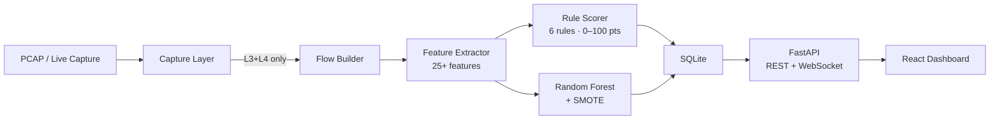
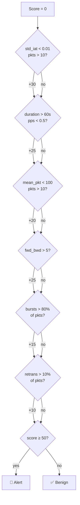
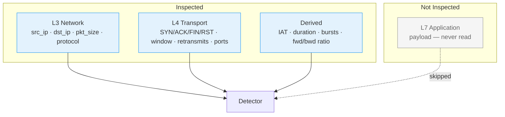
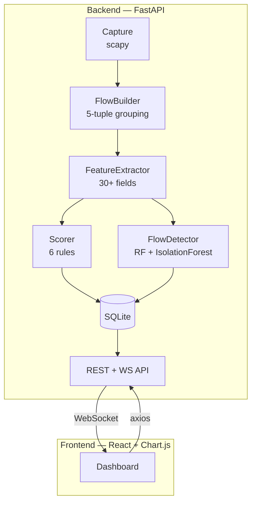
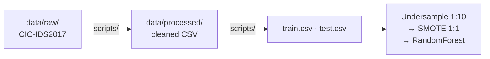

# TCP Covert Channel Detector

[](LICENSE)
[](backend/requirements.txt)
[](frontend/package.json)

---

Imagine a compromised server silently leaking credentials through carefully timed TCP packets. Or a botnet using DNS queries to receive commands. Traditional firewalls and IDS systems miss these attacks because they look like normal traffic.

**Covert channels** hide data in plain sight - using packet timing, header fields, or protocol abuse to exfiltrate information without triggering alarms. They're the invisible threat in your network logs.

## The Problem

- **Traditional DPI fails**: Encrypted traffic makes payload inspection useless
- **Signature-based detection is blind**: Novel covert channels have no known signatures  
- **Manual analysis doesn't scale**: Security teams can't review millions of flows daily
- **Privacy concerns**: Deep packet inspection violates user privacy and regulatory compliance

## The Solution

A privacy-preserving ML system that detects covert channels using **only network metadata** - no payload inspection required. Works on encrypted traffic, scales to enterprise networks, and explains every detection decision.

## What Makes This Different

- **Privacy-First**: Analyzes packet headers only - never reads payload content
- **ML + Rules Hybrid**: Combines interpretable rules with RandomForest for high accuracy
- **Explainable AI**: SHAP values show exactly why each flow was flagged
- **Multi-Protocol**: Detects timing channels (TCP), tunneling (DNS), and steganography (IP ID)
- **Real-Time**: WebSocket streaming with sub-second latency
- **Forensics-Ready**: Auto-captures PCAP evidence for incident response

---

## Key Features

### Detection Capabilities
- **Multi-Protocol Analysis**: TCP, UDP, ICMP, DNS covert channel detection
- **Advanced Techniques**: IP ID steganography, TCP timestamp manipulation, DNS tunneling, packet size encoding
- **Behavioral Profiling**: Per-IP traffic baselines with circadian rhythm analysis
- **Anomaly Detection**: Isolation Forest for zero-day covert channel discovery

### Explainability & Intelligence
- **SHAP Explainability**: Waterfall charts showing feature contributions to each prediction
- **Network Topology**: Force-directed graph with centrality metrics and community detection
- **Threat Intelligence**: IP reputation lookup with GeoIP enrichment
- **Forensic Timeline**: Packet-level reconstruction for suspicious flows

### Operations & Alerting
- **Real-Time Dashboard**: WebSocket streaming with interactive visualizations
- **SMTP Alerting**: Configurable email notifications with severity filtering
- **PCAP Evidence**: Automatic capture of suspicious flows for analysis
- **REST API**: 30+ endpoints for integration with SIEM/SOAR platforms

---

## Pipeline



## Detection Logic



## OSI Layer Coverage



| Layer | What It Catches |
|-------|----------------|
| **L3 — Network** | Who's talking, data volume |
| **L4 — Transport** | Handshake anomalies, flow control abuse |
| **Derived** | Timing patterns, periodicity, asymmetry |
| **L7 — Application** | *Not inspected* |

## Architecture



## Dataset & Training



- **Source**: CIC-IDS2017 Infiltration subset (Canadian Institute for Cybersecurity)
- **Imbalance**: 252,754 BENIGN / 36 Infiltration — handled via undersample → SMOTE pipeline
- **Model**: RandomForest (100 estimators, `class_weight="balanced"`)

## Performance

| Metric | Value |
|--------|-------|
| Recall | 85.7% |
| ROC-AUC | 89.5% |
| Accuracy | 98.1% |
| Attack detection (5-fold CV) | 77.8% (28/36 attacks) |

## API Endpoints

### Core Detection
| Method | Endpoint | Description |
|--------|----------|-------------|
| `GET` | `/flows` | List captured flows |
| `GET` | `/alerts` | Flows with score ≥ threshold |
| `GET` | `/stats` | Aggregate stats + top suspicious IPs |
| `GET` | `/metrics` | Model evaluation metrics |
| `GET` | `/export/alerts` | Download alerts CSV |
| `WS` | `/ws/flows` | Real-time flow stream |

### Capture & Upload
| Method | Endpoint | Description |
|--------|----------|-------------|
| `GET` | `/capture/interfaces` | List available network interfaces |
| `POST` | `/capture/start` | Start live capture (requires admin) |
| `POST` | `/capture/stop` | Stop live capture |
| `POST` | `/upload/pcap` | Upload & process PCAP file |

### Advanced Features
| Method | Endpoint | Description |
|--------|----------|-------------|
| `GET` | `/explain/{flow_id}` | SHAP explanation for specific flow |
| `GET` | `/explain/global` | Global feature importance |
| `GET` | `/topology/graph` | Network graph data |
| `GET` | `/topology/centrality` | Node centrality metrics |
| `GET` | `/topology/top-talkers` | Highest traffic nodes |
| `GET` | `/baseline/stats` | Behavioral baseline statistics |
| `GET` | `/baseline/profile/{ip}` | Traffic profile for IP |
| `GET` | `/baseline/circadian/{ip}` | Hourly activity pattern |
| `GET` | `/threat-intel/lookup/{ip}` | IP reputation lookup |
| `GET` | `/forensics/timeline/{flow_id}` | Forensic timeline |
| `GET` | `/alerts/config` | Alert configuration |
| `POST` | `/alerts/test` | Send test alert email |

## Quick Start

### Prerequisites
- Python 3.10+
- Node.js 16+
- **Windows**: [Npcap](https://npcap.com/) for live capture (optional)

### Installation

```bash
# 1. Install backend dependencies
cd backend
pip install -r requirements.txt

# 2. Install frontend dependencies
cd ../frontend
npm install

# 3. Generate test data (optional)
cd ../backend
python generate_test_data.py
```

### Running

```bash
# Terminal 1: Backend (use admin/sudo for live capture)
cd backend
python -m uvicorn main:app --host 0.0.0.0 --port 8000

# Terminal 2: Frontend
cd frontend
npm run dev
```

Open **http://localhost:5173**

### Live Capture Setup (Windows)

1. Install [Npcap](https://npcap.com/) with WinPcap compatibility
2. Run backend as **Administrator**
3. Get interfaces: `curl http://localhost:8000/capture/interfaces`
4. Select interface with valid IP in dashboard

### SMTP Alerts Configuration

Copy `.env.example` to `.env` and configure:

```bash
SMTP_HOST=smtp.gmail.com
SMTP_PORT=587
SMTP_USER=your-email@gmail.com
SMTP_PASSWORD=your-app-password
SMTP_TO_EMAILS=recipient@example.com
ALERT_ENABLED=true
```

## Covert Channel Types Detected

| Type | Mechanism | Detection Signal |
|------|-----------|-----------------|
| **Timing** | Data encoded in inter-packet delays | Low `std_iat` |
| **Storage** | Data encoded in TCP header fields | Abnormal flag counts, window sizes |
| **Exfiltration** | Asymmetric data flow out | High `fwd_bwd_ratio` |

## Project Structure

```
├── backend/                      FastAPI + ML pipeline
│   ├── main.py                   FastAPI app + WebSocket + all endpoints
│   ├── capture.py                Multi-protocol packet capture (TCP/UDP/ICMP/DNS)
│   ├── capture_windows.py        Windows raw socket fallback
│   ├── protocol_handlers.py      Protocol-specific packet parsing
│   ├── protocol_scorer.py        UDP/ICMP/DNS scoring rules
│   ├── flow_builder.py           5-tuple flow grouping
│   ├── feature_extractor.py      30+ statistical features (OSI-tagged)
│   ├── scorer.py                 TCP rule-based detection (6 rules)
│   ├── ml_model.py               RandomForest + SMOTE pipeline
│   ├── explainability.py         SHAP feature importance
│   ├── network_topology.py       Graph analysis + centrality metrics
│   ├── behavioral_baseline.py    Per-IP profiling + circadian analysis
│   ├── advanced_detection.py     IP ID, TCP timestamp, DNS tunneling
│   ├── threat_intel.py           IP reputation + GeoIP
│   ├── alerting.py               SMTP notifications
│   ├── forensics.py              PCAP evidence collection
│   ├── evaluator.py              Model evaluation + reports
│   ├── database.py               Async SQLite layer
│   ├── config.py                 Configuration management
│   └── generate_test_data.py     Synthetic flow generator
├── frontend/                     React dashboard with sidebar navigation
│   └── src/
│       ├── App.jsx               Main app with view routing
│       └── components/
│           ├── Sidebar.jsx       Navigation sidebar
│           ├── DashboardView.jsx Main overview
│           ├── AlertsView.jsx    Dedicated alerts page
│           ├── NetworkTopology.jsx Force-directed graph
│           ├── ShapExplainer.jsx SHAP waterfall charts
│           ├── BehavioralBaseline.jsx Traffic profiling
│           ├── ThreatIntel.jsx   IP reputation lookup
│           └── FlowTable.jsx     Data table view
├── data/
│   ├── raw/                      CIC-IDS2017 source CSV
│   └── processed/                Train/test splits
├── docs/
│   ├── datasets.md               Available datasets (UNSW-NB15, CTU-13, CICIDS2018)
│   ├── new_endpoints.md          API documentation
│   └── evaluation_report.md      Model performance
└── CAPTURE_SETUP.md              Live capture troubleshooting
```

## Tech Stack

| | |
|---|---|
| **Backend** | Python · FastAPI · Scapy · scikit-learn · SHAP · NetworkX · imbalanced-learn · SQLite |
| **Frontend** | React · Recharts · Framer Motion · React Icons · Vite · Axios |
| **ML/Analysis** | RandomForest · SMOTE · SHAP TreeExplainer · Isolation Forest |
| **Network** | Scapy · Npcap · WebSocket · SMTP |

## Datasets

Three additional datasets available for training (see `docs/datasets.md`):
- **UNSW-NB15**: 9 attack categories, modern network patterns
- **CTU-13**: 13 botnet scenarios, C&C channel patterns  
- **CICIDS2018**: Recent attack vectors, DDoS variants

Use `backend/dataset_preprocessor.py` to merge datasets for improved model generalization.

## Contributing

See [CONTRIBUTING.md](CONTRIBUTING.md) for setup, code style, and PR process.

## License

[MIT](LICENSE)
